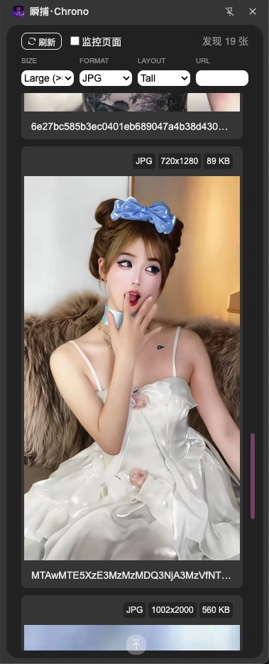

[中文](README.md) [EN](README_en.md)

# 瞬捕 · Chrono
An image quickly capturing plugin for Google Chrome.

## Features
- **One-Click Refresh**: Real-time acquisition of all image resources on the current page
- **Smart Filtering**:
    - By image size (Small/Medium/Large)
    - By format (JPG/PNG/GIF/TIFF)
    - By layout type (Wide/Square/Portrait)
    - Custom URL filtering
- **Batch Operations**:
    - Batch download selected images
    - Real-time page change monitoring
- **Detailed Information Display**:
    - File format/Dimensions/File size
    - Quick preview/share/search
- **Convenient Operations**:
    - Single-click selection/Multi-select mode
    - One-click return to page top

## Screenshot

## Installation (Chrome Extension)
1. Download project files
2. Go to `chrome://extensions/`
3. Enable "Developer mode"
4. Click "Load unpacked extension"
5. Select project root directory

## Usage
1. Open the extension on target webpage
2. Click "Refresh" button to get image list
3. Use filters for precise search
4. Select desired images and click "Download"
5. Long-press image to view detailed information

## Tech Stack
- HTML5
- CSS3 (Flexbox/Grid Layouts)
- JavaScript (ES6+)
- IconPark Icon Library

## Contribution Guide
1. Fork this repository
2. Create new branch (`git checkout -b feature/your-feature`)
3. Commit changes (`git commit -m 'Add some feature'`)
4. Push to branch (`git push origin feature/your-feature`)
5. Submit Pull Request

## License
Apache License 2.0 © 2025 CC.Yao, IAMCC.CN